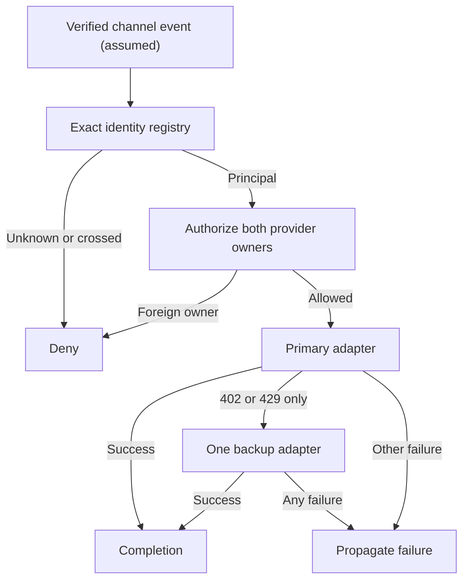

# Architecture and permission boundaries

**This document covers two public examples, not the architecture of the full
private PrincipalMesh platform.** The original has substantially broader backend,
storage, integration, interface and execution components. The intentionally small
demo should not be used to infer the original project's implementation size or
feature set. See the private-platform/public-excerpt comparison in the README.

## One request, two independent checks

The channel adapter and authentication layer are assumed, not implemented.
All provider behavior in the demo is synthetic.

## Identity vocabulary

| Concept | Meaning in this example |
| --- | --- |
| Principal | Application identity owning a configured provider route |
| Channel user | Synthetic sender identifier obtained from a trusted adapter |
| Chat | Synthetic private-channel location; not a principal |
| Tenant / organization | Not modeled; a principal is not an organization |
| Agent / agent instance | Not modeled; no autonomous actor |
| Conversation / session | No persistent session, history or memory |
| Workflow / run / task | One gateway call; no durable workflow engine |

## Decisions and trade-offs

**Exact one-to-one bindings.** An immutable configuration snapshot prevents caller
list mutation from changing the registry. Duplicate principal, user or chat
entries fail at construction. No case folding or whitespace normalization can
silently select a different identity. This intentionally excludes multiple chats
per principal and group chats; a real integration needs an explicit policy.

**Preauthorize both routes.** Even if primary would succeed, an unauthorized
backup invalidates the request before provider I/O. This favors fail-closed
configuration over availability. Owner strings are meaningful only because the
caller and route configuration are trusted. Accepting them from request JSON
would remove this boundary; a real service must resolve routes server-side.

**One narrow fallback.** Only a trusted adapter's `ProviderFailure(402/429)` can
trigger the backup. Generated text does not select a provider or classify an
error. Authentication, transport, timeout and cancellation failures propagate.
Backup failure never re-enters the fallback path. A route name is the identity
in this small model; real systems need canonical provider IDs and ownership
queries. No environment credentials, endpoint overrides or discovery exist.

**Cooperative asynchronous timeout.** Each call receives its own deadline; two
attempts can take roughly twice that duration plus scheduling overhead. Adapters
must cooperate with cancellation. This cannot terminate blocking or malicious
code, and it is not a sandbox or a hard execution budget.

**Request-local state.** The gateway stores only timeout configuration. Selected
routes and results stay local to each call. The concurrency test exercises 20
interleaved requests; it is not a distributed concurrency or load test.

## Sandbox contract: described, not implemented

A real command execution boundary would require a separately authenticated
worker, rootless isolation, no network, bounded resources and output, deadlines,
no host mounts or engine sockets, and audit records. This repository implements
none of those features and never accepts commands to execute.

## What would be required beyond this example

An authenticated transport, server-owned route store, principal-scoped persistent
queries, key management, request/output limits, rate and cost budgets, durable
idempotency, observability, deployment threat modeling and runtime isolation
tests. These are intentionally outside this portfolio's two-example scope.

## Provenance

This is a new educational implementation of selected design ideas. No private
modules, test fixtures, runtime identifiers, operational runbooks or Git history
were imported. Public validation claims apply only to this repository.
